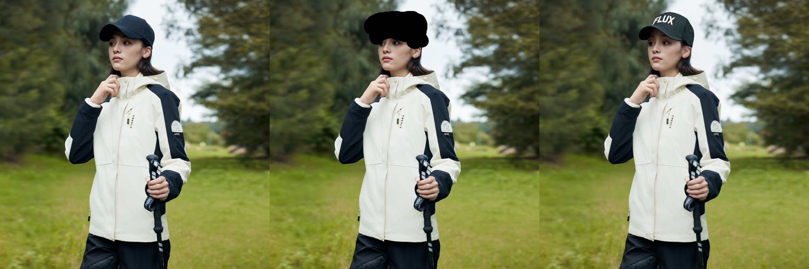
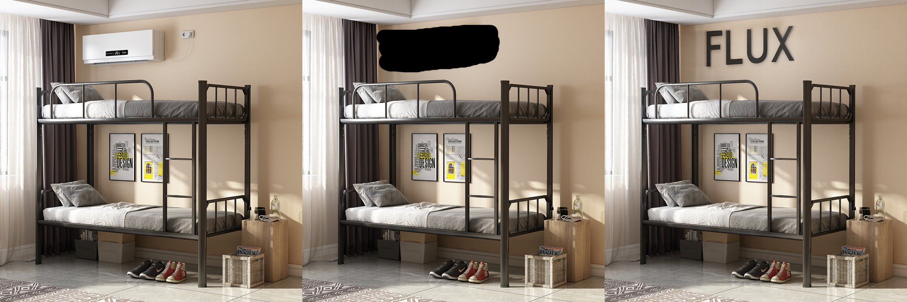
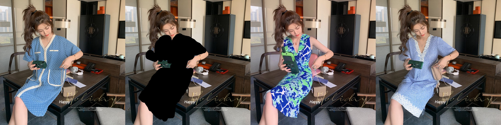
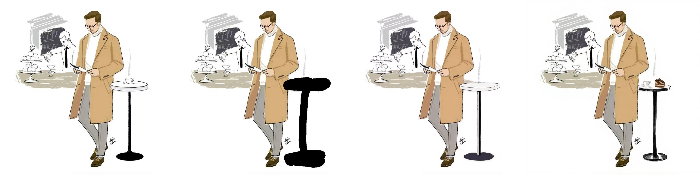

<div style="display: flex;align-items: center;">
  
</div>

This repository provides a Inpainting ControlNet checkpoint for [FLUX.1-dev](https://huggingface.co/black-forest-labs/FLUX.1-dev) model released by researchers from AlimamaCreative Team.

<!-- 使用HTML来调整图标大小 -->
<a href="https://huggingface.co/alimama-creative/FLUX.1-dev-Controlnet-Inpainting-Beta" target="_blank">
     Beta-version model weights have been uploaded to Hugging Face.
</a>

<br/>

<!-- 使用HTML来调整图标大小 -->
<a href="https://huggingface.co/alimama-creative/FLUX.1-dev-Controlnet-Inpainting-Alpha" target="_blank">
     Alpha-version model weights have been uploaded to Hugging Face.
</a>

## News

 🎉 Thanks to @comfyanonymous，ComfyUI now supports inference for Alimama inpainting ControlNet. Workflow can be downloaded from [here](https://huggingface.co/alimama-creative/FLUX.1-dev-Controlnet-Inpainting-Alpha/resolve/main/images/alimama-flux-controlnet-inpaint.json). 
 
ComfyUI Usage Tips:

  * Using the `t5xxl-FP16` and `flux1-dev-fp8` models for 28-step inference, the GPU memory usage is 27GB. The inference time with `cfg=3.5` is 27 seconds, while without `cfg=1` it is 15 seconds. `Hyper-FLUX-lora` can be used to accelerate inference. 
  * You can try adjusting（lower） the parameters `control-strength`, `control-end-percent`, and `cfg` to achieve better results.
  * The following example uses `control-strength` = 0.9 & `control-end-percent` = 1.0 & `cfg` = 3.5

| Input                     | Output                     | Prompt        |
|------------------------------|------------------------------|-------------|
|  |  | <small><i>The image depicts a scene from the anime series Dragon Ball Z, with the characters Goku, <span style="color:red; font-weight:bold;">Elon Musk</span>, and a child version of Gohan sharing a meal of ramen noodles. They are all sitting around a dining table, with Goku and Gohan on one side and Naruto on the other. They are all holding chopsticks and eating the noodles. The table is set with bowls of ramen, cups, and bowls of drinks. The arrangement of the characters and the food creates a sense of camaraderie and shared enjoyment of the meal. |
|  |  | <small><i>The image is an illustration of a man standing in a cafe. He is wearing a white turtleneck, a camel-colored trench coat, and brown shoes. He is holding a cell phone and appears to be looking at it. There is a small table with <span style="color:red; font-weight:bold;">a cat</span> on it to his right. In the background, there is another man sitting at a table with a laptop. The man is wearing a black turtleneck and a tie. </i></small>|
|  |  | <small><i>A woman with blonde hair is sitting on a table wearing a <span style="color:red; font-weight:bold;">red and white long dress</span>. She is holding a green phone in her hand and appears to be taking a photo. There is a bag next to her on the table and a handbag beside her on the chair. The woman is looking at the phone with a smile on her face. The background includes a TV on the left wall and a couch on the right. A chair is also present in the scene. </i></small>|
|  |  | <small><i>The image depicts a beautiful young woman sitting at a desk, reading a book. She has long, wavy brown hair and is wearing a grey shirt with a black cardigan. She is holding a <span style="color:red; font-weight:bold;">red pencil</span> in her left hand and appears to be deep in thought. Surrounding her are numerous books, some stacked on the desk and others placed on a shelf behind her. A potted plant is also visible in the background, adding a touch of greenery to the scene. The image conveys a sense of serenity and intellectual pursuits. </i></small>|


## Model Cards 

* The model was trained on 12M laion2B and internal source images at resolution 1024x1024. The inference performs best at this size, with other sizes yielding suboptimal results.

* The recommended controlnet_conditioning_scale is 0.9 - 1.0.

## Showcase





## Comparison with SDXL-Inpainting

Compared with [SDXL-Inpainting](https://huggingface.co/diffusers/stable-diffusion-xl-1.0-inpainting-0.1)

From left to right: Input image | Masked image | SDXL inpainting | Ours


<small><i>*The image depicts a beautiful young woman sitting at a desk, reading a book. She has long, wavy brown hair and is wearing a grey shirt with a black cardigan. She is holding a pencil in her left hand and appears to be deep in thought. Surrounding her are numerous books, some stacked on the desk and others placed on a shelf behind her. A potted plant is also visible in the background, adding a touch of greenery to the scene. The image conveys a sense of serenity and intellectual pursuits.*</i></small>


<small><i>A woman with blonde hair is sitting on a table wearing a blue and white long dress. She is holding a green phone in her hand and appears to be taking a photo. There is a bag next to her on the table and a handbag beside her on the chair. The woman is looking at the phone with a smile on her face. The background includes a TV on the left wall and a couch on the right. A chair is also present in the scene.</i></small>


<small><i>The image is an illustration of a man standing in a cafe. He is wearing a white turtleneck, a camel-colored trench coat, and brown shoes. He is holding a cell phone and appears to be looking at it. There is a small table with a cup of coffee on it to his right. In the background, there is another man sitting at a table with a laptop. The man is wearing a black turtleneck and a tie. There are several cups and a cake on the table in the background. The man sitting at the table appears to be typing on the laptop.</i></small>


<small><i>The image depicts a scene from the anime series Dragon Ball Z, with the characters Goku, Naruto, and a child version of Gohan sharing a meal of ramen noodles. They are all sitting around a dining table, with Goku and Gohan on one side and Naruto on the other. They are all holding chopsticks and eating the noodles. The table is set with bowls of ramen, cups, and bowls of drinks. The arrangement of the characters and the food creates a sense of camaraderie and shared enjoyment of the meal.</i></small>

## Using with Diffusers
Step1: install diffusers
``` Shell
pip install diffusers==0.30.2
```

Step2: clone repo from github
``` Shell
git clone https://github.com/alimama-creative/FLUX-Controlnet-Inpainting.git
```

Step3: modify the image_path, mask_path, prompt and run
``` Shell
python main.py
```
## LICENSE
Our weights fall under the [FLUX.1 [dev]](https://huggingface.co/black-forest-labs/FLUX.1-dev/blob/main/LICENSE.md) Non-Commercial License.
